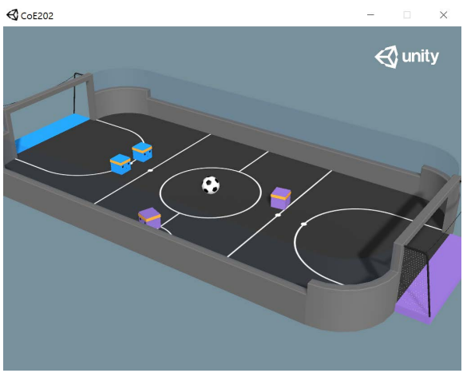
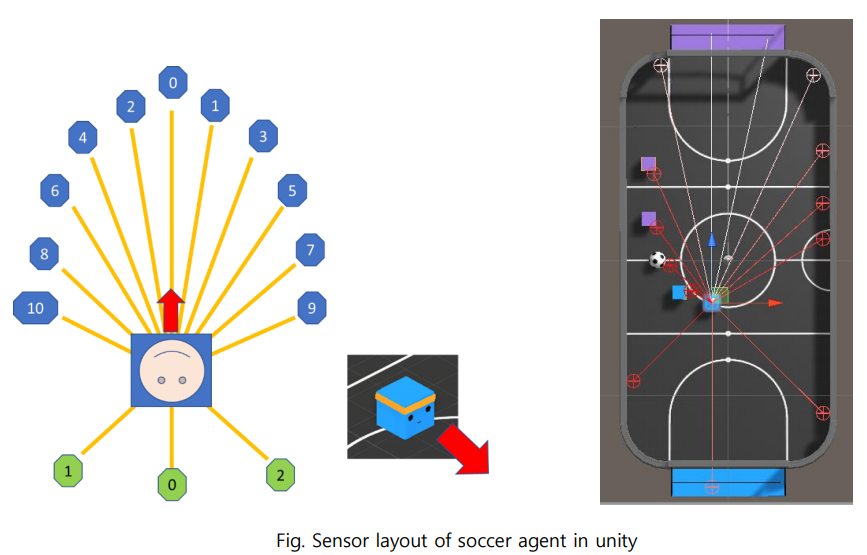
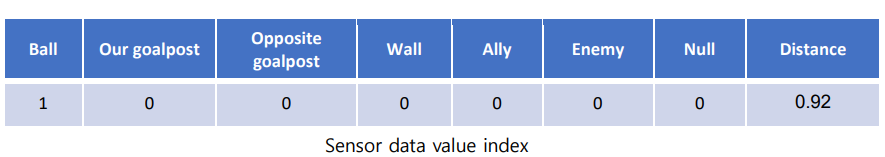

# Abstract
I and my teammates at Kaist university implemented this project as a final project for the course COE202 of our university. 
This project aims to train 2 teams to play against each other by applying reinforcement learning network. 

# About the problem
Our game is a football game in Unity environment, which has 2 team (blue and purple) to play against each other. 
During the match, each agent is equipped with a total of 14 sensors, 11 in front and 3 in the rear. 

In this project, agents must strategically take different actions depending on the type of object detected by the sensor.

And each sensor data includes 8 values 

This data is composed of two types of data, the first (index 0~6) contains information about
detectable objects which the sensor caught, and the second (index 7) represents how far the
detected object is from. 
For example, if 8th sensor catch a ball then it sends [1,0,0,0,0,0,0, distance] as data.
For more detail about problem statement, please download file from this link: 

# Installation
Please notice that this project only run on windows environment
- torch==1.6.0
- torchvision==0.7.0
To install Unity environment, please step-by-step run these commands on the terminal:
1. git clone --branch latest_release https://github.com/Unity-Technologies/ml-agents.git
2. pip install -e ./ml-agents/ml-agents-envs/
3. pip install -e ./ml-agents/ml-agents/
4. pip install -e ./ml-agents/gym-unity/

# Train 
We have two plans for training: 

a) Training only 2 agents from one team, and let 2 agents from the remaining team play randomly

b) Training 4 agents from two teams. 

For plan a), please run file train.py , and for plan b) please run file train_two.py 

During training process, after a certain number of episodes, weights for each agent would be saved. 

# Test
For demo, we have uploaded weights for each agents inside the folder "res" of this project. To see performance of the trained model,
please run file test.py 

# Ideas and tricks used in this project
To improve the performance of our reinforcement learning model, we have implement a lot of tricks, and these tricks
are explained in detail by our team's final presentation that you can find from this link: 
https://www.youtube.com/watch?v=pozj9_ppXP0&t=46s&ab_channel=TienDatNguyen

# Reference
During implementing this project, we apply a lot of tricks that mentioned in the paper http://cs230.stanford.edu/projects_winter_2019/reports/15811878.pdf

